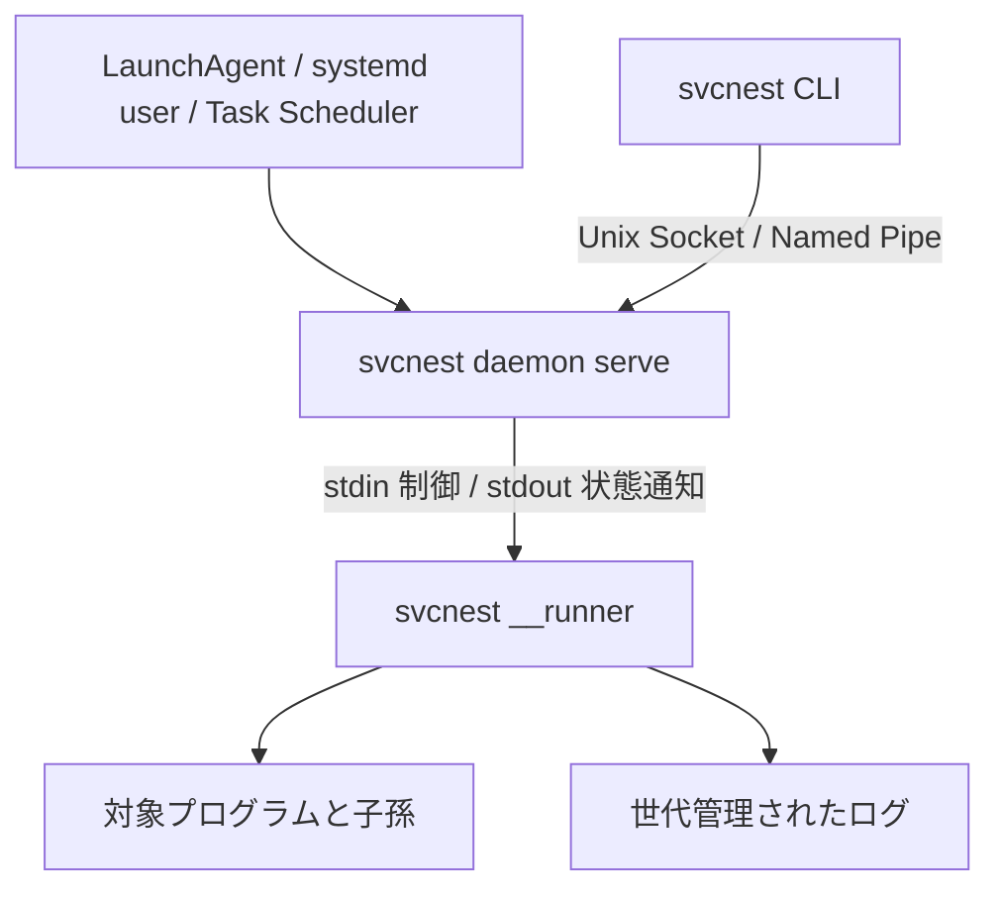

# 実装設計

## 設定と対象解決

`resolve::executable` が登録時の PATH / PATHEXT と cwd から実行ファイルを解決します。元の argv と解決した実行ファイルを設定に保存し、プロセス生成では実行ファイルと引数を直接渡します。CLI の表示用文字列を実行に流用しません。

Windows の npm / npx と Node.js 用 cmd-shim は `resolve::node_shim` が解決します。JavaScript の実体と、隣接または登録時 PATH の Node.js を保存し、Node.js へ script と元 argv の引数を直接渡します。npm の prefix helper がある場合はサービス環境を適用して prefix を検索し、更新された global npm を選びます。対象形式は [npm の npx.cmd](https://github.com/npm/cli/blob/latest/bin/npx.cmd) と [cmd-shim](https://github.com/npm/cmd-shim/blob/main/lib/index.js) に基づきます。

`resolve::service` がサービス名・cwd・親ディレクトリ・曖昧さ・`--all` の規則を一箇所で実装します。すべての通常 CLI 操作と IPC 操作がこれを使用します。明示した名前は cwd に優先し、複数サービスが見つかった階層からさらに親を探索しません。

設定変更は daemon の mutex で直列化します。実行中の設定の置換と削除にはサービスロックの空きを確認します。設定ファイルは同じディレクトリに一時ファイルを作り、内容を同期した後に atomic rename します。Unix ではディレクトリも同期します。CLI の読み取りは更新前か更新後の完全な設定を取得します。

## 起動と停止

daemon はサービス名に対応する runner を一つだけ保持します。起動結果は runner の状態通知を待って返し、起動済みのサービスに対する `start` は成功します。異なる CLI からの同時操作も直列化します。

runner はサービスロックを取得した後に対象を生成します。ロックはバックオフ中も保持します。foreground の `run` も同じロックを使用するため、background と foreground の同時起動はできません。

foreground の Unix 対象には端末の foreground グループを移譲します。起動直後に SIGTTIN で停止した場合も再開し、終了後は元のグループへ端末を戻します。Windows の foreground 対象は現在の console グループに残し、端末の Ctrl+C を直接受信します。起動前に信号ハンドラーを登録し、起動中の割り込みも取りこぼさないようにします。

Unix の対象は別のプロセスグループで起動します。runner はプロセスの親子関係と生成時刻を追跡し、PID が再利用された別プロセスへの停止信号を避けます。Linux では runner を subreaper にして reparent された子孫を回収します。停止では SIGTERM、期限超過後は SIGKILL を使い、生存する子孫がいなくなるまで確認します。runner 自身も daemon とは別グループにし、launchd の daemon グループ終了処理から独立して制御パイプの EOF を処理できます。

Windows の対象は `CREATE_SUSPENDED` で作成し、`JOB_OBJECT_LIMIT_KILL_ON_JOB_CLOSE` を持つ Job Object へ割り当ててからメインスレッドを再開します。生成直後に子孫が Job Object の外へ逃れる競合を避けます。停止では console の CTRL_BREAK を試し、期限後に Job Object を終了し、ActiveProcesses がゼロになるまで確認します。API の根拠は [Microsoft の Job Objects](https://learn.microsoft.com/en-us/windows/win32/procthread/job-objects) と [Process Creation Flags](https://learn.microsoft.com/en-us/windows/win32/procthread/process-creation-flags) です。

親の自然終了時も子孫を停止してから再起動を判断します。手動停止と制御チャネル切断では再起動しません。再起動の間隔と回数制限は `runner::policy` にあり、実時間の待機を使わずにポリシーをテストできます。

## daemon の異常終了

runner の stdin は daemon が所有するパイプです。daemon が異常終了すると EOF になり、runner はツリーを停止して終了します。新しい daemon の runner は、旧 runner が停止を完了してサービスロックを解放するまで待ちます。古いツリーと新しいツリーが重なることを防ぎます。

daemon の単一起動ロックはユーザー単位です。Unix は `/tmp/svcnest-user-<uid>/daemon.lock`、Windows は OS が返す現在ユーザーの LocalAppData 配下の `svcnest/singleton/daemon.lock` を使用します。`--home` や環境変数を変えても二つの daemon は起動しません。Windows のフォルダー取得は [SHGetKnownFolderPath](https://learn.microsoft.com/en-us/windows/win32/api/shlobj_core/nf-shlobj_core-shgetknownfolderpath) を使います。保存先ごとの IPC とは独立して単一起動を保証します。

単一起動ロックを取得してから stale socket を削除・再作成します。新しい daemon が稼働中の socket を削除することはありません。ロックファイルの inode を入れ替える競合を避けるため、通常操作ではロックファイルを削除しません。実動作テストもユーザー単位の規則に従い、daemon を使うケースを直列で実行します。

## IPC、ログ、出力

IPC はバージョン付きの JSON フレームで、上限は 1 MiB です。Unix はディレクトリ・socket の権限と接続相手の UID を確認します。Windows はユーザー SID を DACL に指定し、remote client を拒否します。さらに接続相手のプロセストークンの SID を検証して、別ユーザーが同名パイプを作るなりすましを防ぎます。Native Pipe の生成は [Tokio の ServerOptions](https://docs.rs/tokio/latest/tokio/net/windows/named_pipe/struct.ServerOptions.html)、相手の特定は [Microsoft の GetNamedPipeServerProcessId](https://learn.microsoft.com/en-us/windows/win32/api/winbase/nf-winbase-getnamedpipeserverprocessid) と対応する client API を使います。

対象の stdout / stderr は runner の制御出力と分離します。ログの行バッファは 64 KiB に制限し、改行しない大量出力でもメモリが無制限に増えません。ログのローテーションと CLI の follow は独立し、follow の終了は制御チャネルへ停止命令を送信しません。

follow は既に開いているファイルの残りを読み、保持されている世代を古い順に辿って新しい active へ進みます。列挙中のローテーションでもファイル identity を使って重複を避けます。標準の 10 MiB を超える出力の実動作テストは、二回以上のローテーション、全 800 レコードの欠落・重複なし、元の PID の継続を確認します。

公開の `status --json` / `list --json` は `schema_version: 1` とサービス配列を返します。稼働状態、PID、終了コード、理由を明示し、環境変数の値を含めません。設定の構文エラーも、TOML や env-file の入力値を診断へ転記しません。
